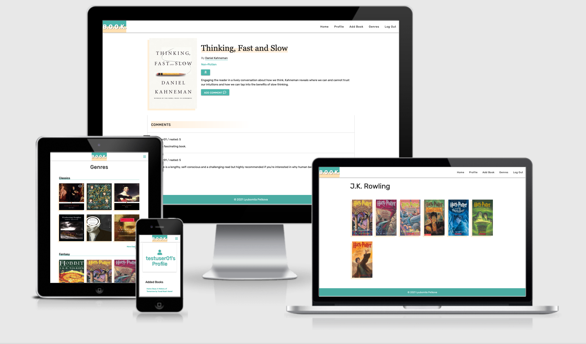
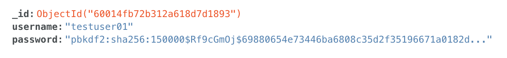
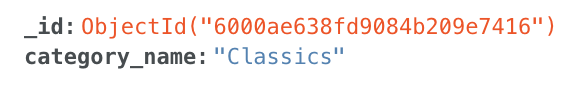
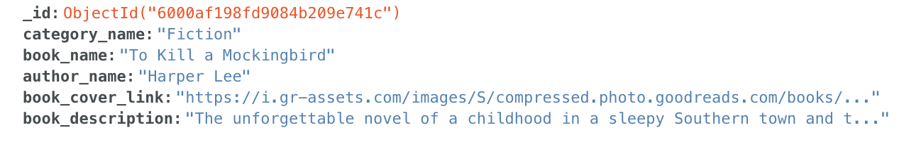
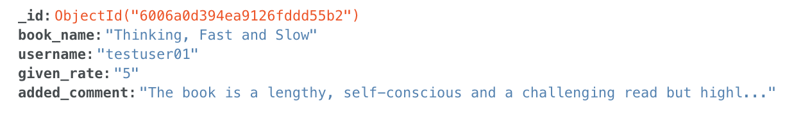
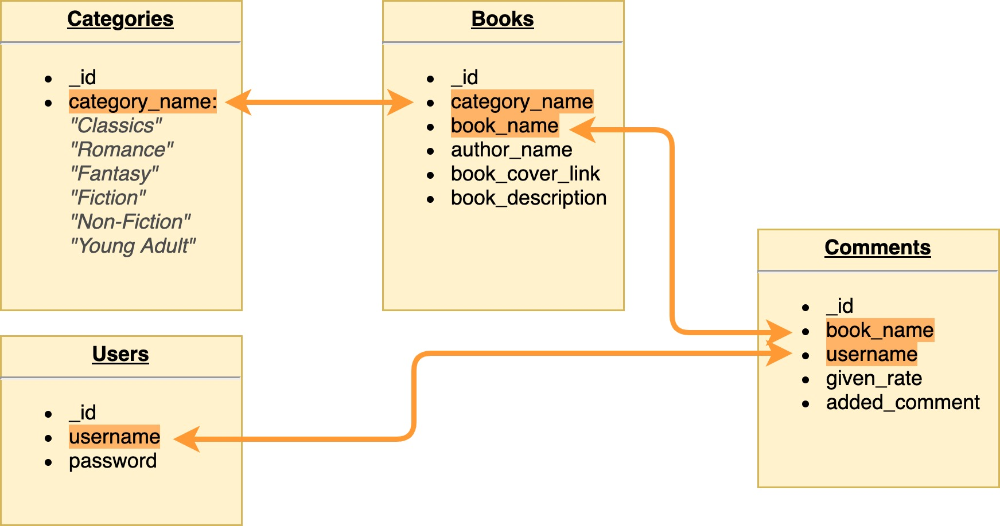

<h1 align="center">B.O.O.K</h1>

B.O.O.K. is my third milestone project. The name stands for "Big Ocean of Knowledge" and it is book review and recommendation site where users can find their next read, add their recent read, rate it and share what is their oppinion about it and discuss it with other users/readers. 

## Demo 

A live demo can be found [here](https://books-ms3.herokuapp.com/).



## User Experience (UX)

- #### As a first time visitor
    1. I want to be able to understand the purpose of the site.
    1. I want to intuitively navigate through the site to browse the content.
    1. I want to be able to search for a specific book.
    1. I want to be able to find the 'Register' page easily.
    1. I want to be able to register easily.
 
- #### As a returning user
    1. I want to be able to navigate to the 'Login' page easily.
    1. I want to be able to Log In quickly.
    1. I want to be able to see the most recent added books.
    1. I want to be able to filter books by their genre.
    1. I want to be able to filter books by their author.
    1. I want to add new books easily.
    1. I want to see list of the books I have added.
    1. I want to be able to rate a book and leave a comment.
    1. I want to be able to edit or delete the rate/comment I have left.
    1. I want to see list of the rates and comments I have left for a book.
    1. I want to view all my activity(added books and comments) on my profile page.
    1. I want to be able to Log out.

- #### As an admin
    1. I want to be able to delete books from the website.
    1. I want to have a control of all data on the website database.


-   ### Wireframes

    [Balsamiq](https://balsamiq.com/) was used wireframing.
    The wireframes can be checked [here](https://github.com/Leoney/book/tree/master/documentation/wireframe).

-   ### Design

    -   #### Colour Scheme
        
        - The three main colors I have used for the design are orange, teal and white.

    -   #### Typography

        I have used three types of fonts: 
        - 'Rubik' with fallback on  Arial and sans-serif font;
        - 'Georgia' with fallback on 'Times New Roman', Times and serif font;

## Features

-   Responsive on all device sizes

-   Interactive elements

    -   #### base.html

        -   All pages will inherit html from base.html which contains website logo, navbar and footer. 
        -   Navabar pre log in: Home, Login, Register
        -   Navabar after register/log in: Home, Profile, Add Book, Genres, Log Out

    -   #### books.html(Home)

        -   Search bar 
        -   Newly Added section with the last 6 added books 

    -   #### login.html

        - Log in form with username and password.
        - Link to registration form if the user hasn't done it yet.

    -   #### register.html

        - Register form with username and password.
        - Link to log in page.

    -   #### add_book.html

        - Add book form which contains fields for: genre, book name, author name, book cover image link and book description. 

    -   #### profile.html

        - User profile page. 
        - Visible after log in. 
        - Contains list with the books and book reviews added by the user.
        - The book reviews have the option to be edited or deleted.

    -  #### book_profile.html
        
        - Contains book details like cover image, book name, author name, shor description, amazon affiliated link(not working yet), comments section. 
        - The author name is a link to author's page with all books by this author. 
        - The comments section has a button for adding new comment which is disabled if the user hasn't logged in. 

    -  #### author.html

        - Author's name and a list with all his books.

    -  #### genres.html

        - Page with all genres and samples of 6 books from each genre.
        - At the end of each genre row there is a link for more book from this genre.(inactive for the moment)

### Features Left to Implement

1. Create an affiliate link in each book profile to online store from where the user might buy it. 
2. In user's profile > Added books section -  to add edit option. 
3. In book's profile to add average rating.
4. In genres page to enable the "More [genre] ... " links. 
5. In author's page to add short biography.
6. An administrator profile privileges to be added so the site administrator can able to edit or delete added by users books. 

## Technologies Used

### Languages Used

-   HTML
-   CSS
-   JavaScript 
-   JQuery 
-   Python3
-   Jinja

### Libraries

-   [MaterializeCSS](https://materializecss.com/): A CSS framework that assists the programmer in creating responsive, mobile first front-end web sites.
-   [Google Fonts](https://fonts.google.com/): A library of free licensed font families 
-   [PyMong](https://pymongo.readthedocs.io/en/stable/): A Python distribution containing tools for working with MongoDB.
-   [Werkzeug Security](https://werkzeug.palletsprojects.com/en/1.0.x/utils/): Provides password security.

### Frameworks

-   [Flask](https://flask.palletsprojects.com/en/1.1.x/): Web framework for developing applications

### Database

-   [MongoDB](https://www.mongodb.com/2): Database service.

## Database

### Structure

- Database 'book_ms3' contain 4 collections
    - **Users** - The main function of this collections is to store user's username and password.

    

    - **Categories** - Contains all categories(genres) of books. Used in back-end logic to let registered and logged in users to filter books by genre.

    

    - **Books** - The main function is to store data about each book. This data is inserted on the 'Add Book' page only by registered and logged in users.

    

    - **Comments** - This collection is mainly used alongside the 'Books' collection to facilitate rating and leaving a comment about specific book functionality.

    

### Relationship
- The relationship between different fields is shown in the image below.


### Deployment

- [Heroku](https://signup.heroku.com/?c=70130000000NeLCAA0&gclid=EAIaIQobChMIvb-6i4-47gIVi-5RCh2mLgpTEAAYASAAEgJSj_D_BwE): cloud platform as a service

- [Git](https://git-scm.com/): A version control system for tracking changes in source code during software development.

- [GitHub](https://github.com/): A provider of Internet hosting for software development and version control using Git.

## Testing

All testing was documented in [testing.md](https://github.com/Leoney/book/tree/master/testing.md) file.

## Deployment

### Local

#### Pre-requisites
- [Python 3](https://www.python.org/downloads/) - used to write the code and to run the project
- [PIP](https://pypi.org/project/pip/) - used to install packages
- [Git](https://git-scm.com/downloads) - used for version control
- [Visual Studio Code](https://code.visualstudio.com/) or any IDE of your choice - used to compile the code.
- [MongoDB Atlas](https://www.mongodb.com/cloud/atlas) account - used to facilitate databases and collections needed throughout the project. More detailed instructions on how to get started in [Mongo DB Atlas docs](https://docs.atlas.mongodb.com/)

### Steps
1. Go to the project repository https://github.com/Leoney/book
2. Get the files by:
    1. Clicking the 'Code' button located in the top section of the repositoryand then select 'Download ZIP' and unzip the files in the directory of your choice.
    OR
    2. Clone the repository by running the following command from your IDE
    ``` git clone https://github.com/Leoney/book.git ```
3. In your IDE, navigate to the project directory where you located downloaded files/cloned the repo.
    ``` cd  local/path/to/project ```
4. Python 3 has a built-in virtual environment [venv](https://docs.python.org/3/tutorial/venv.html). which you will have to initialize by running the following command:
    ``` python3 -m venv .<name of your virtual environment> ```
5. Activate your virtual environment:
    - on MacOS: ``` source .<name of your virtual environment>/bin/activate ``` 
    - on Windows: ```source .<name of your virtual environment>/Scripts\activate.bat```
6. Install all requirements from requrements.txt file:
    ``` pip3 install -r requirements.txt ```
7. Create a file `env.py` to store environment variables.
8. Add environment variable in the format as shown below, where the `SECRET_KEY` value is a key of your choice and `MONGO_URI` is obained from your MongoDB account under Overview > Connect > Connect your application and select relevant version of Python.
        os.environ.setdefault("SECRET_KEY", "")
        os.environ.setdefault("MONGO_URI", "")
9. In MongoDB create the following:
    - database with name 'book-ms3'
    - collection named 'categories' and add 6 documents with field category_name, one document for each in the list: "Classics", "Romace", "Fantasy" "Fiction", "Non-Fiction", "Young Adults".
        _id: <ObjectId>
        category_name: <String>
        - Refer to [this example](./documentations/database/categories.png).
    - collection named 'users':
        _id: <ObjectId>
        username: <String>
        password: <String>
        - Refer to [this example](./documentations/database/users.png).
    - collection named 'books':
        _id: <ObjectId>
        category_name: <String>
        book_name: <String>
        author_name: <String>
        book_cover_link: <String>
        book_description: <String>
        - Refer to [this example](./documentations/database/books.png).
    - collection named 'comments':
        _id: <ObjectId>
        book_name: <String>
        username: <String>
        given_rate: <String>
        added_comment: <String>
        - Refer to [this example](./documentations/database/comments.png).

10. Run the application
    ``` python3 app.py ```

11. After you run it, in your terminal will be displayed the link on which the web app is accessible.

## Remote

1. In your local project repository create requirements.txt file which to contain all the dependancies that have to be installed. It can be done by running the command bellow in your CLI: 
    ```pip3 freeze --local > requirements.txt```
2. Next create Procfile. It should be always with capital P and it specifies the commands that are executed by the app on startup. It can be done by running the command bellow in your CLI: 
    ```echo web: python app.py > Procfile```
3. Push all the files to your Git repository.
4. Register and log in [Heroku](https://signup.heroku.com/?c=70130000000NeLCAA0&gclid=EAIaIQobChMIvb-6i4-47gIVi-5RCh2mLgpTEAAYASAAEgJSj_D_BwE)
5. In Heroku click on 'Create  New App'. It has to be with unique name and for region choose the nearest to you one.
6. In the newly created app, go to Settings -> Config Vars. Here add the variables and theit values:
    -   IP = 0.0.0.0
    -   PORT = 5000
    -   SECRET_KEY = [Your Secret key]
    -   MONGO_DBNAME = [Name of DB]
    -   MONGO_URI = [MongoDb connection string]
7. To connect your project through the GitHub repository, again in your Heroku app, this time go to Deploy -> Deployment method and choose GitHub. Then select the master branch and enable automatic deployment. 

## Credits

- Code Institute Tutorials 
- [MaterializeCSS](https://materializecss.com/)
- [w3school](https://www.w3schools.com/)
- [stackoverflow](https://stackoverflow.com/)
- [Goodreads](https://www.goodreads.com/)- image links and style credits.

### Acknowledgements

-   Tutor support at Code Institute for their support.
-   Code Institute's Slack Channels.
